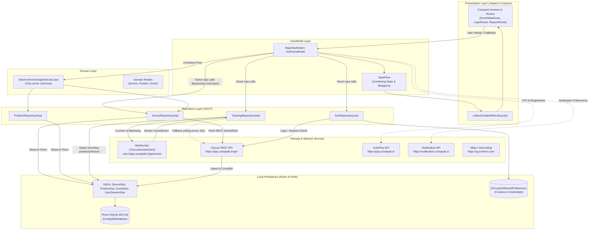

# Comprehensive Architecture Analysis: Uzradyab Native Kotlin

> **Project:** Uzradyab Android Native Application (`org.uzradyab.manager`)  
> **Repository:** `uzradyab-native-kotlin`  
> **Generated:** September 2026  
> **Scope:** Architecture Patterns, UI & State Management, Dependency Injection, Data & Network Layer, Domain Logic, Technical Debt, and Modernization Roadmap.

---

## 1. Tech Stack Summary

The technology stack is configured through modern Android Gradle standards (Gradle Version Catalog `libs.versions.toml` and Kotlin DSL `build.gradle.kts`):

| Category | Component / Library | Version | Notes / Architectural Role |
| :--- | :--- | :--- | :--- |
| **Language & Tooling** | Kotlin | `2.0.21` | Kotlin Compose Compiler Plugin (`2.0.21`), JVM 17 target |
| | Android Gradle Plugin (AGP) | `8.11.2` | Compile SDK: `36`, Target SDK: `36`, Min SDK: `24` |
| | KSP | `2.0.21-1.0.28` | Kotlin Symbol Processing for Hilt and Room code-gen |
| **UI Framework** | Jetpack Compose BOM | `2024.09.00` | 100% declarative UI with Material 3 and Material Icons Extended |
| | Navigation Compose | `2.9.6` | In-app screen routing via NavHost |
| | Lifecycle Runtime Compose | `2.10.0` | `collectAsStateWithLifecycle()` for lifecycle-aware flow collection |
| | Activity Compose | `1.12.2` | Edge-to-edge system bar integration and component activity |
| | Core Splashscreen | `1.0.1` | Android 12+ backwards-compatible system splashscreen |
| **Dependency Injection**| Dagger Hilt | `2.57.1` | Application-level DI (`@HiltAndroidApp`, `SingletonComponent`) |
| | Hilt Navigation Compose | `1.3.0` | ViewModel retrieval scoped to Compose navigation backstack |
| | Hilt Work | `1.3.0` | Background worker assisted injection (`@HiltWorker`) |
| **Local Persistence** | AndroidX Room | `2.8.4` | SQLite ORM (`UzradyabDatabase` v5) with Room KTX & manual migrations |
| | AndroidX Security Crypto | `1.1.0-alpha06` | `EncryptedSharedPreferences` for cookies, tokens, and biometric flags |
| **Networking & API** | OkHttp | `4.12.0` | Custom `PersistentCookieJar`, connection pool, and WebSocket client |
| | Retrofit | `3.0.0` | REST client with Gson converter (`2.13.2`) interfacing with 4 endpoints |
| | Kotlinx Coroutines | `1.9.0` | Asynchronous streams, state sharing (`StateFlow`), and reactive DB queries |
| **Maps & Geo** | MapLibre Native SDK | `11.11.0` | Vector and raster tile map rendering, 100MB ambient tile LRU cache |
| | MapLibre Annotation Plugin| `3.0.2` | Symbol layer marker rendering and live vehicle heading rotation |
| **Background Processing**| AndroidX WorkManager | `2.11.0` | Background sync and periodic cache cleanup runtime |
| **Firebase & Cloud** | Firebase BOM | `33.7.0` | Cloud Messaging (`FCM`), Crashlytics, and Analytics |
| **Hardware & Security** | AndroidX Biometric | `1.2.0-alpha05` | BiometricPrompt (Fingerprint / Face authentication) |
| | Play Services Auth Phone | `18.1.0` | SMS Retriever API for automated OTP extraction |

---

## 2. Core Architectural Evaluation

### 2.1 Architectural Pattern: MVVM vs. Clean Architecture
The codebase primarily adheres to **MVVM (Model-View-ViewModel) with Unidirectional Data Flow (UDF)**:
- **Presentation Layer**: Composable screens observe immutable `StateFlow` streams exposed by `@HiltViewModel` classes and communicate actions upwards via lambdas.
- **Data Layer**: Clean separation of Local (`data/local` with Room DAOs and entities) and Remote (`data/remote` with Retrofit APIs and WebSocket client) coordinated via Repositories (`data/repository`).
- **Domain Layer Gap**: While `domain/model` and `domain/repository` (interfaces) exist, **true Clean Architecture is incomplete**. ViewModels bypass use cases and orchestrate business logic, network polling, date formatting, and persistence directly.

### 2.2 Package Organization: Layer vs. Feature Analysis
The project uses a **hybrid package-by-layer at root, package-by-feature within presentation** approach:
```
com.example.uzradyab
├── core/                  # Shared infrastructural code (biometric, debug, designsystem, network, security, utils)
├── data/                  # Data tier (local/dao/database/entity, remote/api/dto/websocket, repository, mapper)
├── di/                    # Hilt dependency injection modules (DatabaseModule, NetworkModule, RepositoryModule, UtilModule)
├── domain/                # Business domain (manager, model, repository interfaces, usecase)
├── map/                   # Root-level MapLibre offline configuration & styles (structural anomaly)
├── presentation/          # Package-by-feature UI (auth, alerts, command, device, events, geofence, map, reports, etc.)
├── service/               # Background services (FcmService)
├── sync/                  # WorkManager workers (worker/)
├── ui/                    # Legacy theme package (Color, Theme, Type)
└── util/                  # Top-level UiText wrapper (structural anomaly)
```

#### Package Organization Deficiencies:
1. **Utility Fragmentation**: Utilities are scattered across three separate packages:
   - `com.example.uzradyab.core.util` (`StringProvider.kt`)
   - `com.example.uzradyab.core.utils` (`FormatUtils.kt`, `ImmutableCollections.kt`, `JalaliUtils.kt`)
   - `com.example.uzradyab.util` (`UiText.kt`)
2. **Theme Triplication**:
   - `com.example.uzradyab.ui.theme` (`Color.kt`, `Theme.kt`, `Type.kt`)
   - `com.example.uzradyab.presentation.theme` (`ThemeViewModel.kt`)
   - `com.example.uzradyab.core.theme` (Empty orphan directory)
3. **Misplaced Root Packages**: `map/` resides at the root package level rather than inside `core/map` or `data/map`.

---

## 3. UI & State Management

### 3.1 Jetpack Compose Implementation & State Modeling
- **Single State Containers**: Screens model UI state via data classes (e.g., `HomeMapUiState`, `AuthUiState`, `ReplayUiState`).
- **Stability Wrappers**: Because standard Kotlin `List` and `Map` collections can lead to unnecessary recompositions, the project introduces custom stability delegates in `ImmutableCollections.kt` using Compose `@Immutable` (`ImmutableListWrapper`, `ImmutableMapWrapper`).
- **Exposure Mechanism**: ViewModels expose `StateFlow<T>` either via `_state.asStateFlow()` or combined reactive pipelines using `.stateIn(viewModelScope, SharingStarted.WhileSubscribed(5_000), ...)`.
- **Lifecycle-Aware Collection**: Composables leverage `collectAsStateWithLifecycle()` to stop flow collection when the app goes into the background.

### 3.2 Navigation Architecture
- **Implementation**: Defined centrally inside `UzradyabApp.kt` via a single monolithic `NavHost`.
- **Pattern**: String-based routing via a private `AppRoute` enum (`AppRoute.Home.path = "/home"`). Query parameters are manually formatted using string templates (e.g., `"${AppRoute.Events.path}?deviceId=$deviceId"`).
- **Navigation Coupling**: `UzradyabApp.kt` has ballooned to over 830 lines, hosting not just screen destinations, but also exit bottom sheets, app update sheets, crash report dialogs, and version string parsers.

### 3.3 State Management Anti-Patterns Identified
- **State-as-Events (Anti-Pattern)**: One-shot side-effects (snackbars, toast notifications, navigation triggers) are stored as mutable nullable fields inside the state data class (e.g., `val errorMessage: String?`, `val isSignedIn: Boolean`). Composables consume them using `LaunchedEffect(state.errorMessage)` and immediately invoke a clear method (e.g., `viewModel.clearMessages()`). This introduces race conditions and potential message drops during rapid recomposition or configuration changes.
- **ViewModel Dual-State Desynchronization (Active Bug)**:
  In `MapViewModel.kt`:
  - `localState` (`MutableStateFlow<HomeMapUiState>`) is combined with `observeHomeSnapshot()` to form `uiState`.
  - The merged snapshot positions are emitted into `uiState`, but are **never written back to `localState`**.
  - In `selectDevice(deviceId)`:
    ```kotlin
    val hasPosition = localState.value.latestPositions[deviceId] != null
    // localState.value.latestPositions is ALWAYS empty!
    // hasPosition is ALWAYS false!
    ```
    This causes the UI to unconditionally display `"هنوز موقعیتی برای این دستگاه ثبت نشده است."` even when valid device coordinates are present.

---

## 4. Dependency Injection (Hilt Setup)

### 4.1 Component Hierarchy & Scoping
- **Flat Hierarchy**: All Hilt modules (`NetworkModule.kt`, `DatabaseModule.kt`, `RepositoryModule.kt`, `UtilModule.kt`) are installed in `SingletonComponent::class`.
- **Scope Allocation**:
  - Repositories and network clients are marked `@Singleton`.
  - Room DAOs are provided without explicit `@Singleton` (relying on the parent database singleton lifetime).
  - No `@ActivityRetainedScoped` or custom feature-level scopes exist.

### 4.2 DI Architectural Issues
1. **Activity Prop-Drilling**:
   In `MainActivity.kt`, 7 dependencies (`BiometricHelper`, `SessionEventBus`, `NetworkEventBus`, `AuthRepository`, `AppConfigRepository`, `ThemeRepository`, `FcmTokenManager`) are `@Inject` field-injected into the activity and then passed down as parameter arguments into `UzradyabAppRoot` and `UzradyabApp`. This bypasses Compose Hilt resolution and couples top-level composables to activity internals.
2. **NetworkModule Responsibility Leak**:
   `NetworkModule.kt` directly constructs and binds `provideGeocoderRepository`, violating module cohesion when an explicit `RepositoryModule.kt` exists.
3. **Context Leaking into ViewModels**:
   `StartupViewModel.kt` and `OnboardingViewModel.kt` directly inject `@ApplicationContext private val context: Context` to interact with raw `SharedPreferences`, coupling the presentation layer directly to Android platform storage APIs.

---

## 5. Data & Network Layer

### 5.1 Architecture & Single Source of Truth (SSOT)
The data layer is well-designed around an **offline-first Room Single Source of Truth**:
- Repositories return reactive `Flow<List<T>>` directly from Room DAOs.
- Network and WebSocket updates write through to Room entities via mappers (`toEntity()`).
- Room automatically invalidates queries and pushes refreshed data down the Flow pipeline to UI collectors.

### 5.2 Remote Networking Subsystem
The application interfaces with 4 external server endpoints configured through BuildConfig:
1. **Traccar Core API (`app.uzradyab.ir`)**:
   - Handled by `TraccarApi.kt`.
   - Session authentication managed via `PersistentCookieJar.kt` using `EncryptedSharedPreferences`.
   - Interceptors handle 401 Unauthorized broadcasts (`UnauthorizedInterceptor`) and network connectivity issues (`NetworkErrorInterceptor`).
2. **Pay / Auth Helper API (`pay.uzradyab.ir`)**:
   - Uses a dedicated "Bare" OkHttpClient without cookie persistence to avoid session contamination.
3. **Notification Microservice (`notification.uzradyab.ir`)**:
   - Reuses the core OkHttp connection pool but attaches `CsrfInterceptor.kt` extracting CSRF tokens from cookies.
4. **Map.ir Reverse Geocoding (`rg.exirfirm.com`)**:
   - Uses the bare client for external reverse geocoding lookups.

### 5.3 WebSocket & Real-Time Tracking
- `TraccarSocketClient.kt` wraps an OkHttp `WebSocket` with a 25-second ping interval to prevent mobile carrier NAT timeouts.
- `TrackingRepositoryImpl.kt` orchestrates:
  - Exponential backoff reconnects (2s up to 60s).
  - Watchdog heartbeat (verifying message receipt within a 90s threshold).
  - Automatic fallback to REST polling (`api.getPositions()` every 45s) when the socket fails.

### 5.4 Local Persistence & Storage Fragmentation
- **Room Database**: `UzradyabDatabase.kt` contains 7 entities with manual migrations (`1->2`, `2->3`, `3->4`, `4->5`). Note that `exportSchema = false` prevents compile-time schema verification.
- **Absence of Jetpack DataStore**: Configuration and user preferences are fragmented across multiple uncoordinated `SharedPreferences` files:
  - `"uzradyab_prefs"` (Onboarding & startup flags)
  - `"map_settings_prefs"` (Map tile choices & tracked device IDs)
  - `"uzradyab_changelog_prefs"` (Version code tracking)
- **Fragile Parsing in Mappers**: In `DeviceMappers.kt`, the current odometer mileage (`currentKilometers`) is extracted by running a regex against a raw JSON string stored in the SQLite database (`"currentKilometers"\s*:\s*"?(\d+(?:\.\d+)?)"?`), rather than deserializing the attributes column via a typed Room `TypeConverter` or Moshi/Gson adapter.

---

## 6. Domain Logic & Business Rules

### 6.1 Anemic Domain Layer
The project contains only **one single UseCase class**:
- `ObserveHomeSnapshotUseCase.kt`: Combines `deviceRepository.observeDevices()` and `positionRepository.observeLatestPositions()`.

### 6.2 Domain Boundary Inversion & Bleed
Business domain managers directly violate Clean Architecture inversion principles:
1. `FcmTokenManager.kt`: Resides in `domain/manager`, yet directly injects `TraccarApi.kt` (a Retrofit interface from the data layer) and imports Google SDK `FirebaseMessaging`.
2. `ChangelogManager.kt`: Resides in `domain/manager`, yet directly injects Android `Context` and invokes `PackageManager` and `SharedPreferences`.

### 6.3 Overburdened ViewModels
Because use cases are absent, ViewModels bear heavy business orchestration burdens:
- `MapViewModel.kt`: Injects 8 distinct repositories/use cases, manages background loops for server health checks (`while(true) delay(30m)`), polls latest device events (`while(true) delay(2m)`), and computes UTC date ranges.
- `AuthViewModel.kt`: Manages 3 disparate sub-flows (`Login`, `Register`, `ForgotPassword`) in a single 560-line ViewModel with 18 state properties and inline password regex validation.

---

## 7. Data Flow Visualization



---

## 8. Architectural Anti-Patterns & Technical Debt

### 1. Dual-State Desynchronization Bug in `MapViewModel`
- **Location**: `presentation/map/MapViewModel.kt` (lines 87-172)
- **Impact**: When switching devices, `localState.value.latestPositions` is queried, but this state is never populated (only the outer `uiState` combined flow receives positions). As a result, the user is erroneously warned that their device has no coordinates on every selection.

### 2. Leaky Domain Abstractions
- **Location**: `domain/manager/FcmTokenManager.kt` & `domain/manager/ChangelogManager.kt`
- **Impact**: Classes situated inside the `domain` layer directly import Retrofit network interfaces (`TraccarApi`), Google Firebase SDKs (`FirebaseMessaging`), and Android OS primitives (`Context`, `PackageManager`, `SharedPreferences`), violating Clean Architecture dependencies.

### 3. "State-as-Events" Race Conditions in Compose
- **Location**: `presentation/auth/LoginScreen.kt` & `presentation/map/HomeMapScreen.kt`
- **Impact**: Transient events like `errorMessage`, `infoMessage`, and `isSignedIn` are stored in state data classes and observed via `LaunchedEffect(state.field)`. This can cause duplicate UI alerts on orientation changes or missed snackbars during rapid state transitions.

### 4. Dead Code & Orphan Services
- **Location**: `data/remote/UzradyabFirebaseMessagingService.kt`
- **Impact**: The app has two Firebase messaging services. `service/FcmService.kt` is declared in `AndroidManifest.xml`, while `UzradyabFirebaseMessagingService.kt` is unregistered and completely unreferenced.
- **Unused WorkManager Workers**: `sync/worker/CacheCleanupWorker.kt` and `sync/worker/FallbackPositionSyncWorker.kt` are never enqueued or scheduled anywhere in the codebase.
- **Obsolete Tests**: `OsmdroidApiTest.kt` and `OsmdroidClassesTest.kt` remain in the test suite despite the osmdroid library having been completely replaced by MapLibre.

### 5. Monolithic Navigation Shell
- **Location**: `UzradyabApp.kt`
- **Impact**: Over 830 lines in a single composable file mixing 22 screen navigation routes with deep dialog logic (app update sheets, crash reporters, exit modals). Routes rely on manual string concatenation and string query parsing rather than Navigation 2.8+ type-safe Kotlin serializable routes.

### 6. Fragile Regular Expression Parsing in Entity Mappers
- **Location**: `data/mapper/DeviceMappers.kt` (line 22)
- **Impact**: `currentKilometers` is parsed from raw SQLite JSON text columns using regular expressions rather than typed Gson/Room converters. Minor schema changes or formatting differences from the Traccar backend can silently corrupt mileage display.

### 7. Storage Layer Fragmentation
- **Location**: `StartupViewModel`, `OnboardingViewModel`, `ThemeRepositoryImpl`, `DefaultMapSettingsRepository`, `PersistentCookieJar`
- **Impact**: No unified Jetpack DataStore exists. The app mixes plain `SharedPreferences` files with `EncryptedSharedPreferences`, and ViewModels hold direct references to Android `Context`.

---

## 9. Actionable Recommendations

### Phase 1: High Priority (Bug Fixes & Technical Debt Removal)
1. **Fix `MapViewModel` State Reference**:
   Refactor `MapViewModel.selectDevice` to query the snapshot positions emitted by `observeHomeSnapshot()` or inspect `uiState.value.latestPositions` rather than reading the unpopulated `localState.value.latestPositions`.
2. **Purge Orphan Services & Workers**:
   - Delete the unreferenced `UzradyabFirebaseMessagingService.kt`.
   - Delete obsolete `Osmdroid*Test` files in `app/src/test`.
   - Either schedule `CacheCleanupWorker.kt` via a periodic WorkManager request on app launch or remove it.
3. **Consolidate Duplicate Theme & Utility Packages**:
   - Delete the empty `core/theme` directory.
   - Merge `core/util`, `core/utils`, and `uzradyab/util` into a single coherent `core/util` package.
   - Move the root-level `map/` directory into `core/map` or `data/map`.

### Phase 2: Medium Priority (Architecture & State Modernization)
4. **Transition from State-as-Events to UI Event Channels**:
   Introduce a `Channel<UiEvent>` / `Flow<UiEvent>` inside ViewModels for one-shot side-effects (e.g., `UiEvent.ShowSnackbar(message)`, `UiEvent.Navigate(destination)`). Collect events in the UI using a lifecycle-aware effect collector (`LaunchedEffectWithLifecycle` or `Flow.collectWithLifecycle`) without mutating state.
5. **Modernize to Type-Safe Compose Navigation**:
   Migrate `androidx.navigation.compose` from string routes (e.g., `AppRoute.Home.path`) to Kotlin 2.0 `@Serializable` type-safe destinations:
   ```kotlin
   @Serializable data object HomeRoute
   @Serializable data class EventsRoute(val deviceId: Long?)
   ```
   Split the monolithic `UzradyabApp.kt` by creating dedicated feature navigation extensions (e.g., `authGraph()`, `reportGraph()`, `mapGraph()`).
6. **Decouple Clean Architecture Boundaries**:
   - Move `FcmTokenManager` and `ChangelogManager` out of `domain/manager` and into `data/manager` or `service/manager`, or abstract their hardware/API dependencies behind pure Kotlin domain interfaces.
   - Extract domain UseCases from `MapViewModel.kt` (e.g., `CheckServerHealthUseCase`, `GetDailyDistanceUseCase`, `GetLatestDeviceEventsUseCase`).

### Phase 3: Long-Term (Maintainability & Modularity)
7. **Adopt Jetpack Preferences DataStore**:
   Replace disparate `SharedPreferences` files (`uzradyab_prefs`, `map_settings_prefs`, `uzradyab_changelog_prefs`) with strongly-typed `DataStore<Preferences>`, injected via Hilt into Repositories rather than ViewModels.
8. **Replace Regex Attribute Parsing with Typed Converters**:
   Create a typed `DeviceAttributes` data model and configure a Room `@TypeConverter` with Gson/Kotlinx Serialization to eliminate regex parsing in entity mappers.
9. **Multi-Module Preparation**:
   As the codebase expands, prepare for modularization by isolating functional boundaries into Gradle modules:
   - `:core:designsystem` (Compose design tokens, buttons, theme)
   - `:core:network` (OkHttp, Retrofit, CookieJar, WebSocket)
   - `:core:database` (Room database, entities, DAOs)
   - `:feature:map`, `:feature:auth`, `:feature:reports` (Composables, ViewModels, and feature navigation)
